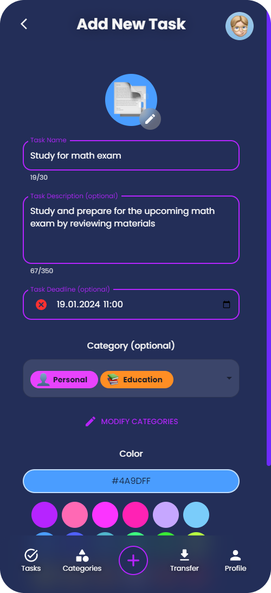

<!-- prettier-ignore -->

<h1>📝React.js Task Flow</h1>

## [https://todo-new-azure.vercel.app](https://todo-new-azure.vercel.app)

## ⚡ Features

- **📦 Local and session storage**: Save tasks locally and retain form data using session storage.
- **😜 Custom Emojis**: The app features custom emojis and different emoji styles to choose from, including Apple, Facebook, Twitter, Google and Native.
- **🔗 Share tasks by link**: Easily share your tasks with others using a link or QR code, with the option to download the QR code. [Example Link](https://todo-new-azure.vercel.app/share?task=%7B%22done%22%3Afalse%2C%22pinned%22%3Afalse%2C%22name%22%3A%22Hello%22%2C%22description%22%3A%22Now%22%2C%22color%22%3A%22%23b624ff%22%2C%22date%22%3A%222024-06-06T22%3A45%3A25.358Z%22%2C%22deadline%22%3A%222024-06-06T23%3A44%3A00.000Z%22%2C%22category%22%3A%5B%7B%22id%22%3A%22857f0db6-43b2-43eb-8143-ec4e26472516%22%2C%22name%22%3A%22Home%22%2C%22emoji%22%3A%221f3e0%22%2C%22color%22%3A%22%231fff44%22%7D%2C%7B%22id%22%3A%220292cba5-f6e2-41c4-b5a7-c59a0aaecfe3%22%2C%22name%22%3A%22Work%22%2C%22emoji%22%3A%221f3e2%22%2C%22color%22%3A%22%23248eff%22%7D%2C%7B%22id%22%3A%22a47a4af1-d720-41eb-9121-d3728605a62b%22%2C%22name%22%3A%22Personal%22%2C%22emoji%22%3A%221f464%22%2C%22color%22%3A%22%23e843fe%22%7D%5D%7D&userName=Faith)  

<!--   -->

- **📱 Clean and responsive design**: Ensures smooth user experience on various devices.
- **🔍 Highlighted Links in Task Descriptions**: Links included in task descriptions will be visually highlighted for easier identification and access.
- **🌐 Native Intl Integration**: Adapts to your language, timezone, and date preferences using the native `Intl` API.
- **🌍 Browser Translation Support**: Seamlessly translate the entire page into different languages using your browser's translation feature, ensuring accessibility for users worldwide.
- **🗂️ Customizable Categories**: Users can create and personalize task categories to suit their preferences.
- **🨠Color Themes**: Users can choose several app color themes.   
- **🗃️ Multi-Task Selection**: Option to select multiple tasks and perform actions on all of them at once.   
- **🔎 Search Tasks**: Search functionality allows you to filter tasks by name or description, making it easy to find what you need.
- **🗣️ Task Reading Aloud**: Option to have tasks read aloud using the native `SpeechSynthesis` API, with a selection of voices to choose from.  
  
- **📥 Import/Export Tasks**: Users can import and export tasks to/from JSON files. This feature allows users to back up their tasks or transfer them to other devices easily. [Example Import File](https://github.com/faithful1ofall/TaskFlow/blob/main/example-import.json)
- **📴 Works offline**: This app is a Progressive Web App (PWA), which means it can be installed on your device, used even when you're offline and behave like a normal application with shortcuts and badges. 
  

## 📷 Screenshots

## 🚀 Performance

## 💻 Tech Stack

- React
- Typescript
- Vite
- Emotion
- MUI

## 👨‍💻 Installation

To install and run the project locally, follow these steps:

- Clone the repository: `git clone https://github.com/faithful1ofall/TaskFlow.git`
- Navigate to the project directory: `cd TaskFlow`
- Install the dependencies: `npm install`
- Start the development server: `npm run dev`

The app will now be running at [http://localhost:5173/](http://localhost:5173/).
